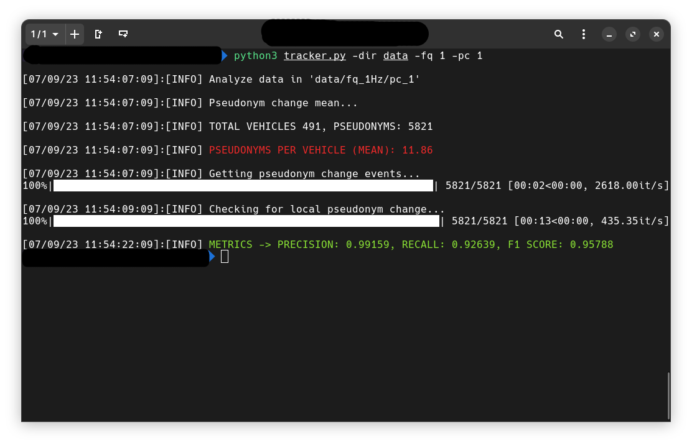

# PTS - PSEUDONYMS TRACKING FRAMEWORK (VTC Fall 2023)

This is the official GitHub repository for the paper "Are VANETs pseudonyms effective? An experimental evaluation of pseudonym tracking in adversarial scenario", presented at VTC Fall 2023. The repository contains our code implementation and instructions on how to run the PTS framework.

To perform our simulation we use the VM offered by [VEINS](https://veins.car2x.org/) extending it by installing [F2MD](https://github.com/josephkamel/F2MD) framework. We simulate the attacker antennas using the RSU dislocated over the [MASA](https://www.automotivesmartarea.it/) scenario.


**As a matter of file size, we only upload one simulation output obtained using a sending message frequency of 1Hz.**

## Execution of the PTF
To test our framework we provide the output of one simulation which is stored in a compressed archive named `simulation_output.tgz`.\
The data obtained from the simulation must respect the following constrains:

- each antenna have to store the eavesdropped messages in a comma separated values (CSV) file, whose name can be defined in the python script (line 36). The default is `rsu[{antenna_num}]bsm.csv`.
- the resulting csv output include some mandatory columns, while others are optional.
    
    **Mandatory**:
    ```
    t, realID, pseudonym, pos.x, pos.y, speed.x, speed.y, accel.x, accel.y, heading.x, heading.y
    ```
    Where *t* is the timestamp of message received, *pseudonym* is the pseudonym of the message, *pos.x* and *pos.y* are the two coordinates of the vehicles. While the latest six values representing kinematic values regarding the actual status of the vehicle sending the message.
    In particular *speed*, *acceleration* and *heading* of the vehicle each divided into two columns representing the two (x,y) components of the vector.

    **Optional:**
    ```
    length, width
    ```
    Which correspond to the vehicles dimensions. Using the optional parameter `--dim` in the `tracker.py` to include the vehicles dimensions as filter .


To test our tracking framework follow these steps:

1. Create the python environment and install all the requirements.
    
    ```bash
    python3 -m venv env
    source env/bin/activate
    pip3 install -r requirements.txt
    ```

2. Unzip the necessary file. 

    ```bash
    tar xzf simulation_results.tgz
    ``` 
    This command will unzip the one simulation output for the 1Hz frequency mentioned above.\
    In particular the extraction process create the following directory tree structure:
    ```
    data
    └── fq_1Hz
        ├── pc_1
        │   ├── rsu[0]bsm.csv
        │   ├── rsu[1]bsm.csv
        │   └── rsu[2]bsm.csv
        ├── pc_2
        │   ├── rsu[0]bsm.csv
        │   ├── rsu[1]bsm.csv
        │   └── rsu[2]bsm.csv
        ├── pc_3
        │   ├── rsu[0]bsm.csv
        │   ├── rsu[1]bsm.csv
        │   └── rsu[2]bsm.csv
        ├── pc_4
        │   ├── rsu[0]bsm.csv
        │   ├── rsu[1]bsm.csv
        │   └── rsu[2]bsm.csv
        └── pc_5
            ├── rsu[0]bsm.csv
            ├── rsu[1]bsm.csv
            └── rsu[2]bsm.csv
    ```
    Where 'pc' represent the PCS and the csv files contains all the message eavesdropped by the three antenna strategically dislocated in the scenario.
    
    **IMPORTANT:** The directory structure must reflect the one shown to ensure proper functioning of the PTS.

3. Run the tracker framework considering a the first Pseudonyms Change Scheme(Periodical). Change 'pc' arguments for changing the PCS analyzed.

    ```bash
    python3 tracker.py -dir data/ -fq 1 -pc 1
    ```

    The output results: \
    


4. **OPTIONAL** To automatically run the tracking framework considering considering all the Pseudonyms Change Scheme (PCS) and the message frequency:

    ```bash
    bash run_all.sh
    ```
